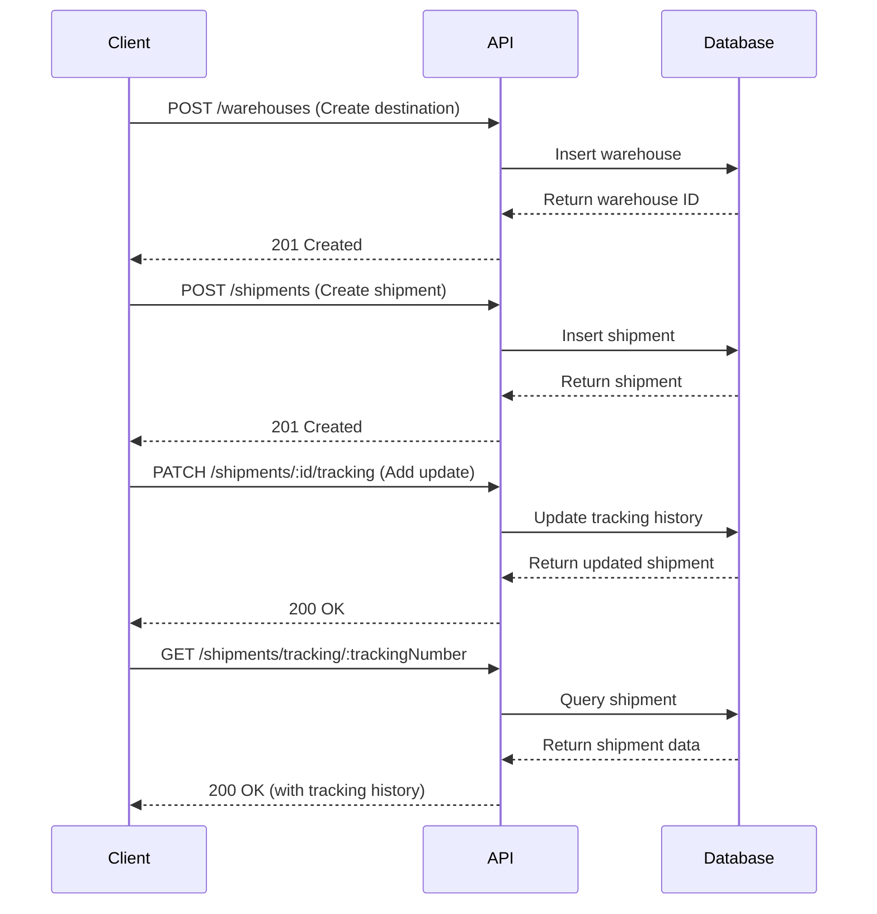
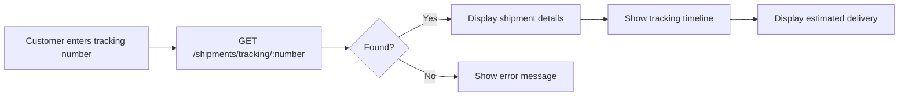

# API Documentation / เอกสาร API

Complete REST API documentation for the Transportation System.

เอกสาร REST API ฉบับสมบูรณ์สำหรับระบบติดตามการขนส่ง

## Quick Links / ลิงก์ด่วน

- [Base URL](#base-url)
- [Authentication](#authentication)
- [Shipments API](#shipments-api)
- [Warehouses API](#warehouses-api)
- [API Workflows](#api-workflows)
- [Error Handling](#error-handling)
- [Postman Collection](#postman-collection)

---

## Base URL

```
Development: http://localhost:3000
Production:  https://your-domain.com
```

## Swagger Documentation

Interactive API documentation with try-it-out functionality:

```
http://localhost:3000/api
```

Features:
- ✅ Try API calls directly from browser
- ✅ View request/response schemas
- ✅ Download OpenAPI specification
- ✅ Test authentication flows

## Authentication

**Current Status:** Open API (No authentication required)

**Future Implementation:** JWT-based authentication

```http
Authorization: Bearer <your-jwt-token>
```

---

## Shipments API

Base path: `/shipments`

### Get All Shipments

Retrieve a list of all shipments in the system.

```http
GET /shipments
```

**Query Parameters:**

None (pagination and filtering to be implemented)

**Success Response (200 OK):**

```json
[
  {
    "_id": "507f1f77bcf86cd799439011",
    "trackingNumber": "TRK123456",
    "senderName": "John Doe",
    "senderAddress": "123 Main St, Bangkok 10100",
    "senderPhone": "0812345678",
    "receiverName": "Jane Smith",
    "receiverAddress": "456 Oak Ave, Chiang Mai 50000",
    "receiverPhone": "0887654321",
    "itemDescription": "Electronics - Laptop",
    "weight": 5.5,
    "quantity": 2,
    "status": "in_transit",
    "estimatedDeliveryDate": "2025-10-25T00:00:00.000Z",
    "actualDeliveryDate": null,
    "destinationWarehouse": "507f1f77bcf86cd799439012",
    "trackingHistory": [
      {
        "location": "Bangkok Distribution Center",
        "timestamp": "2025-10-19T14:30:00.000Z",
        "notes": "Package received at warehouse"
      }
    ],
    "notes": "Handle with care - fragile items",
    "createdAt": "2025-10-19T10:00:00.000Z",
    "updatedAt": "2025-10-19T14:30:00.000Z"
  }
]
```

**cURL Example:**

```bash
curl -X GET http://localhost:3000/shipments \
  -H "Content-Type: application/json"
```

---

### Get Shipment by ID

Retrieve a specific shipment by its database ID.

```http
GET /shipments/:id
```

**Path Parameters:**

| Parameter | Type | Required | Description |
|-----------|------|----------|-------------|
| id | string | Yes | MongoDB ObjectId of the shipment |

**Success Response (200 OK):**

```json
{
  "_id": "507f1f77bcf86cd799439011",
  "trackingNumber": "TRK123456",
  "senderName": "John Doe",
  "senderAddress": "123 Main St, Bangkok 10100",
  "senderPhone": "0812345678",
  "receiverName": "Jane Smith",
  "receiverAddress": "456 Oak Ave, Chiang Mai 50000",
  "receiverPhone": "0887654321",
  "itemDescription": "Electronics - Laptop",
  "weight": 5.5,
  "quantity": 2,
  "status": "in_transit",
  "estimatedDeliveryDate": "2025-10-25T00:00:00.000Z",
  "actualDeliveryDate": null,
  "destinationWarehouse": {
    "_id": "507f1f77bcf86cd799439012",
    "name": "Chiang Mai Distribution Center",
    "city": "Chiang Mai"
  },
  "trackingHistory": [
    {
      "location": "Bangkok Distribution Center",
      "timestamp": "2025-10-19T14:30:00.000Z",
      "notes": "Package received at warehouse"
    }
  ],
  "notes": "Handle with care - fragile items",
  "createdAt": "2025-10-19T10:00:00.000Z",
  "updatedAt": "2025-10-19T14:30:00.000Z"
}
```

**Error Response (404 Not Found):**

```json
{
  "statusCode": 404,
  "message": "Shipment with ID 507f1f77bcf86cd799439011 not found",
  "error": "Not Found"
}
```

**cURL Example:**

```bash
curl -X GET http://localhost:3000/shipments/507f1f77bcf86cd799439011 \
  -H "Content-Type: application/json"
```

---

### Track Shipment by Tracking Number

Search for a shipment using its tracking number. This is the primary method for customers to track their packages.

```http
GET /shipments/tracking/:trackingNumber
```

**Path Parameters:**

| Parameter | Type | Required | Description |
|-----------|------|----------|-------------|
| trackingNumber | string | Yes | Unique tracking number (e.g., TRK123456) |

**Success Response (200 OK):**

```json
{
  "_id": "507f1f77bcf86cd799439011",
  "trackingNumber": "TRK123456",
  "senderName": "John Doe",
  "receiverName": "Jane Smith",
  "receiverAddress": "456 Oak Ave, Chiang Mai 50000",
  "itemDescription": "Electronics - Laptop",
  "weight": 5.5,
  "quantity": 2,
  "status": "in_transit",
  "estimatedDeliveryDate": "2025-10-25T00:00:00.000Z",
  "trackingHistory": [
    {
      "location": "Lampang Transit Hub",
      "timestamp": "2025-10-19T18:00:00.000Z",
      "notes": "Package in transit to destination"
    },
    {
      "location": "Bangkok Distribution Center",
      "timestamp": "2025-10-19T14:30:00.000Z",
      "notes": "Package received at warehouse"
    },
    {
      "location": "Bangkok Pickup Point",
      "timestamp": "2025-10-19T10:00:00.000Z",
      "notes": "Package picked up from sender"
    }
  ],
  "notes": "Handle with care - fragile items"
}
```

**Error Response (404 Not Found):**

```json
{
  "statusCode": 404,
  "message": "Shipment with tracking number TRK123456 not found",
  "error": "Not Found"
}
```

**cURL Example:**

```bash
curl -X GET http://localhost:3000/shipments/tracking/TRK123456 \
  -H "Content-Type: application/json"
```

**Use Case:**

This endpoint is perfect for:
- Customer tracking portals
- Mobile app tracking screen
- Email/SMS tracking links
- Customer service lookups

---

### Create Shipment

Create a new shipment record in the system.

```http
POST /shipments
Content-Type: application/json
```

**Request Body:**

| Field | Type | Required | Description |
|-------|------|----------|-------------|
| trackingNumber | string | Yes | Unique tracking number |
| senderName | string | Yes | Name of sender |
| senderAddress | string | Yes | Full sender address |
| senderPhone | string | Yes | Sender phone number |
| receiverName | string | Yes | Name of receiver |
| receiverAddress | string | Yes | Full receiver address |
| receiverPhone | string | Yes | Receiver phone number |
| itemDescription | string | Yes | Description of items |
| weight | number | Yes | Weight in kg |
| quantity | number | Yes | Number of items |
| status | string | No | Initial status (default: "pending") |
| estimatedDeliveryDate | date | No | Estimated delivery date |
| destinationWarehouse | string | No | Warehouse ID |
| notes | string | No | Additional notes |

**Request Example:**

```json
{
  "trackingNumber": "TRK123456",
  "senderName": "John Doe",
  "senderAddress": "123 Main St, Bangkok 10100",
  "senderPhone": "0812345678",
  "receiverName": "Jane Smith",
  "receiverAddress": "456 Oak Ave, Chiang Mai 50000",
  "receiverPhone": "0887654321",
  "itemDescription": "Electronics - Laptop and accessories",
  "weight": 5.5,
  "quantity": 2,
  "status": "pending",
  "estimatedDeliveryDate": "2025-10-25",
  "notes": "Handle with care - fragile items"
}
```

**Success Response (201 Created):**

```json
{
  "_id": "507f1f77bcf86cd799439011",
  "trackingNumber": "TRK123456",
  "senderName": "John Doe",
  "senderAddress": "123 Main St, Bangkok 10100",
  "senderPhone": "0812345678",
  "receiverName": "Jane Smith",
  "receiverAddress": "456 Oak Ave, Chiang Mai 50000",
  "receiverPhone": "0887654321",
  "itemDescription": "Electronics - Laptop and accessories",
  "weight": 5.5,
  "quantity": 2,
  "status": "pending",
  "estimatedDeliveryDate": "2025-10-25T00:00:00.000Z",
  "trackingHistory": [],
  "notes": "Handle with care - fragile items",
  "createdAt": "2025-10-19T10:00:00.000Z",
  "updatedAt": "2025-10-19T10:00:00.000Z"
}
```

**Error Response (400 Bad Request):**

```json
{
  "statusCode": 400,
  "message": [
    "trackingNumber should not be empty",
    "weight must be a positive number"
  ],
  "error": "Bad Request"
}
```

**cURL Example:**

```bash
curl -X POST http://localhost:3000/shipments \
  -H "Content-Type: application/json" \
  -d '{
    "trackingNumber": "TRK123456",
    "senderName": "John Doe",
    "senderAddress": "123 Main St, Bangkok 10100",
    "senderPhone": "0812345678",
    "receiverName": "Jane Smith",
    "receiverAddress": "456 Oak Ave, Chiang Mai 50000",
    "receiverPhone": "0887654321",
    "itemDescription": "Electronics - Laptop",
    "weight": 5.5,
    "quantity": 2,
    "status": "pending",
    "estimatedDeliveryDate": "2025-10-25"
  }'
```

---

### Update Shipment

Update shipment information such as status, notes, or delivery date.

```http
PATCH /shipments/:id
Content-Type: application/json
```

**Path Parameters:**

| Parameter | Type | Required | Description |
|-----------|------|----------|-------------|
| id | string | Yes | MongoDB ObjectId of the shipment |

**Request Body (all fields optional):**

```json
{
  "status": "in_transit",
  "estimatedDeliveryDate": "2025-10-24",
  "notes": "Package picked up and in transit"
}
```

**Success Response (200 OK):**

```json
{
  "_id": "507f1f77bcf86cd799439011",
  "trackingNumber": "TRK123456",
  "status": "in_transit",
  "estimatedDeliveryDate": "2025-10-24T00:00:00.000Z",
  "notes": "Package picked up and in transit",
  "updatedAt": "2025-10-19T14:00:00.000Z"
}
```

**cURL Example:**

```bash
curl -X PATCH http://localhost:3000/shipments/507f1f77bcf86cd799439011 \
  -H "Content-Type: application/json" \
  -d '{
    "status": "in_transit",
    "notes": "Package picked up and in transit"
  }'
```

---

### Add Tracking Update

Add a new tracking history entry to a shipment. This creates a timeline of the package's journey.

```http
PATCH /shipments/:id/tracking
Content-Type: application/json
```

**Path Parameters:**

| Parameter | Type | Required | Description |
|-----------|------|----------|-------------|
| id | string | Yes | MongoDB ObjectId of the shipment |

**Request Body:**

| Field | Type | Required | Description |
|-------|------|----------|-------------|
| location | string | Yes | Location name or description |
| timestamp | datetime | No | Timestamp (defaults to now) |
| notes | string | No | Additional notes for this update |

**Request Example:**

```json
{
  "location": "Bangkok Distribution Center",
  "timestamp": "2025-10-19T14:30:00.000Z",
  "notes": "Package arrived at warehouse and processed"
}
```

**Success Response (200 OK):**

```json
{
  "_id": "507f1f77bcf86cd799439011",
  "trackingNumber": "TRK123456",
  "trackingHistory": [
    {
      "location": "Bangkok Distribution Center",
      "timestamp": "2025-10-19T14:30:00.000Z",
      "notes": "Package arrived at warehouse and processed"
    },
    {
      "location": "Bangkok Pickup Point",
      "timestamp": "2025-10-19T10:00:00.000Z",
      "notes": "Package picked up from sender"
    }
  ],
  "updatedAt": "2025-10-19T14:30:00.000Z"
}
```

**cURL Example:**

```bash
curl -X PATCH http://localhost:3000/shipments/507f1f77bcf86cd799439011/tracking \
  -H "Content-Type: application/json" \
  -d '{
    "location": "Bangkok Distribution Center",
    "timestamp": "2025-10-19T14:30:00.000Z",
    "notes": "Package arrived at warehouse and processed"
  }'
```

**Use Cases:**

- Driver scans package at pickup
- Warehouse receives package
- Package departs facility
- Package out for delivery
- Package delivered

---

### Delete Shipment

Delete a shipment from the system. **Use with caution** - this cannot be undone.

```http
DELETE /shipments/:id
```

**Path Parameters:**

| Parameter | Type | Required | Description |
|-----------|------|----------|-------------|
| id | string | Yes | MongoDB ObjectId of the shipment |

**Success Response (200 OK):**

```json
{
  "_id": "507f1f77bcf86cd799439011",
  "trackingNumber": "TRK123456",
  "status": "pending"
}
```

**Error Response (404 Not Found):**

```json
{
  "statusCode": 404,
  "message": "Shipment with ID 507f1f77bcf86cd799439011 not found",
  "error": "Not Found"
}
```

**cURL Example:**

```bash
curl -X DELETE http://localhost:3000/shipments/507f1f77bcf86cd799439011 \
  -H "Content-Type: application/json"
```

---

## Warehouses API

Base path: `/warehouses`

### Get All Warehouses

Retrieve a list of all warehouses, stores, and distribution centers.

```http
GET /warehouses
```

**Query Parameters:**

None (filtering to be implemented)

**Success Response (200 OK):**

```json
[
  {
    "_id": "507f1f77bcf86cd799439012",
    "name": "Bangkok Central Warehouse",
    "address": "789 Industrial Rd",
    "city": "Bangkok",
    "province": "Bangkok",
    "postalCode": "10100",
    "phone": "021234567",
    "email": "bangkok@warehouse.com",
    "type": "warehouse",
    "coordinates": {
      "lat": 13.7563,
      "lng": 100.5018
    },
    "isActive": true,
    "capacity": 10000,
    "manager": "Somchai Prasert",
    "notes": "Main distribution center for Bangkok area",
    "createdAt": "2025-10-19T10:00:00.000Z",
    "updatedAt": "2025-10-19T10:00:00.000Z"
  },
  {
    "_id": "507f1f77bcf86cd799439013",
    "name": "Chiang Mai Store #1",
    "address": "123 Main Street",
    "city": "Chiang Mai",
    "province": "Chiang Mai",
    "postalCode": "50000",
    "phone": "053111222",
    "email": "chiangmai@store.com",
    "type": "store",
    "coordinates": {
      "lat": 18.7883,
      "lng": 98.9853
    },
    "isActive": true,
    "capacity": 500,
    "manager": "Arisara Kaewmanee",
    "notes": "Retail store in city center",
    "createdAt": "2025-10-19T10:00:00.000Z",
    "updatedAt": "2025-10-19T10:00:00.000Z"
  }
]
```

**cURL Example:**

```bash
curl -X GET http://localhost:3000/warehouses \
  -H "Content-Type: application/json"
```

---

### Get Active Warehouses

Retrieve only active (operational) warehouses.

```http
GET /warehouses/active
```

**Success Response (200 OK):**

Returns array of warehouses where `isActive: true`

```json
[
  {
    "_id": "507f1f77bcf86cd799439012",
    "name": "Bangkok Central Warehouse",
    "isActive": true,
    ...
  }
]
```

**cURL Example:**

```bash
curl -X GET http://localhost:3000/warehouses/active \
  -H "Content-Type: application/json"
```

**Use Case:**

- Display dropdown of available delivery destinations
- Show operational facilities only
- Filter for shipment assignment

---

### Get Warehouse by ID

Retrieve details of a specific warehouse.

```http
GET /warehouses/:id
```

**Path Parameters:**

| Parameter | Type | Required | Description |
|-----------|------|----------|-------------|
| id | string | Yes | MongoDB ObjectId of the warehouse |

**Success Response (200 OK):**

```json
{
  "_id": "507f1f77bcf86cd799439012",
  "name": "Bangkok Central Warehouse",
  "address": "789 Industrial Rd",
  "city": "Bangkok",
  "province": "Bangkok",
  "postalCode": "10100",
  "phone": "021234567",
  "email": "bangkok@warehouse.com",
  "type": "warehouse",
  "coordinates": {
    "lat": 13.7563,
    "lng": 100.5018
  },
  "isActive": true,
  "capacity": 10000,
  "manager": "Somchai Prasert",
  "notes": "Main distribution center for Bangkok area",
  "createdAt": "2025-10-19T10:00:00.000Z",
  "updatedAt": "2025-10-19T10:00:00.000Z"
}
```

**Error Response (404 Not Found):**

```json
{
  "statusCode": 404,
  "message": "Warehouse with ID 507f1f77bcf86cd799439012 not found",
  "error": "Not Found"
}
```

**cURL Example:**

```bash
curl -X GET http://localhost:3000/warehouses/507f1f77bcf86cd799439012 \
  -H "Content-Type: application/json"
```

---

### Create Warehouse

Create a new warehouse, store, or distribution center.

```http
POST /warehouses
Content-Type: application/json
```

**Request Body:**

| Field | Type | Required | Description |
|-------|------|----------|-------------|
| name | string | Yes | Warehouse name |
| address | string | Yes | Street address |
| city | string | Yes | City name |
| province | string | Yes | Province/state |
| postalCode | string | Yes | Postal code |
| phone | string | Yes | Contact phone |
| email | string | No | Contact email |
| type | string | Yes | Type: warehouse, store, or distribution_center |
| coordinates | object | No | GPS coordinates (lat, lng) |
| isActive | boolean | No | Active status (default: true) |
| capacity | number | No | Capacity in units |
| manager | string | No | Manager name |
| notes | string | No | Additional notes |

**Request Example:**

```json
{
  "name": "Bangkok Central Warehouse",
  "address": "789 Industrial Rd",
  "city": "Bangkok",
  "province": "Bangkok",
  "postalCode": "10100",
  "phone": "021234567",
  "email": "bangkok@warehouse.com",
  "type": "warehouse",
  "coordinates": {
    "lat": 13.7563,
    "lng": 100.5018
  },
  "isActive": true,
  "capacity": 10000,
  "manager": "Somchai Prasert",
  "notes": "Main distribution center for Bangkok area"
}
```

**Success Response (201 Created):**

```json
{
  "_id": "507f1f77bcf86cd799439012",
  "name": "Bangkok Central Warehouse",
  "address": "789 Industrial Rd",
  "city": "Bangkok",
  "province": "Bangkok",
  "postalCode": "10100",
  "phone": "021234567",
  "email": "bangkok@warehouse.com",
  "type": "warehouse",
  "coordinates": {
    "lat": 13.7563,
    "lng": 100.5018
  },
  "isActive": true,
  "capacity": 10000,
  "manager": "Somchai Prasert",
  "notes": "Main distribution center for Bangkok area",
  "createdAt": "2025-10-19T10:00:00.000Z",
  "updatedAt": "2025-10-19T10:00:00.000Z"
}
```

**Error Response (400 Bad Request):**

```json
{
  "statusCode": 400,
  "message": [
    "name should not be empty",
    "type must be one of: warehouse, store, distribution_center"
  ],
  "error": "Bad Request"
}
```

**cURL Example:**

```bash
curl -X POST http://localhost:3000/warehouses \
  -H "Content-Type: application/json" \
  -d '{
    "name": "Bangkok Central Warehouse",
    "address": "789 Industrial Rd",
    "city": "Bangkok",
    "province": "Bangkok",
    "postalCode": "10100",
    "phone": "021234567",
    "email": "bangkok@warehouse.com",
    "type": "warehouse",
    "isActive": true,
    "capacity": 10000,
    "manager": "Somchai Prasert"
  }'
```

---

### Update Warehouse

Update warehouse information such as status, manager, or contact details.

```http
PATCH /warehouses/:id
Content-Type: application/json
```

**Path Parameters:**

| Parameter | Type | Required | Description |
|-----------|------|----------|-------------|
| id | string | Yes | MongoDB ObjectId of the warehouse |

**Request Body (all fields optional):**

```json
{
  "isActive": false,
  "manager": "New Manager Name",
  "notes": "Temporarily closed for maintenance"
}
```

**Success Response (200 OK):**

```json
{
  "_id": "507f1f77bcf86cd799439012",
  "name": "Bangkok Central Warehouse",
  "isActive": false,
  "manager": "New Manager Name",
  "notes": "Temporarily closed for maintenance",
  "updatedAt": "2025-10-19T15:00:00.000Z"
}
```

**cURL Example:**

```bash
curl -X PATCH http://localhost:3000/warehouses/507f1f77bcf86cd799439012 \
  -H "Content-Type: application/json" \
  -d '{
    "isActive": false,
    "notes": "Temporarily closed for maintenance"
  }'
```

---

### Delete Warehouse

Delete a warehouse from the system. **Use with caution** - this cannot be undone.

```http
DELETE /warehouses/:id
```

**Path Parameters:**

| Parameter | Type | Required | Description |
|-----------|------|----------|-------------|
| id | string | Yes | MongoDB ObjectId of the warehouse |

**Success Response (200 OK):**

```json
{
  "_id": "507f1f77bcf86cd799439012",
  "name": "Bangkok Central Warehouse",
  "isActive": true
}
```

**Error Response (404 Not Found):**

```json
{
  "statusCode": 404,
  "message": "Warehouse with ID 507f1f77bcf86cd799439012 not found",
  "error": "Not Found"
}
```

**cURL Example:**

```bash
curl -X DELETE http://localhost:3000/warehouses/507f1f77bcf86cd799439012 \
  -H "Content-Type: application/json"
```

---

## API Workflows

### Common Workflow Examples

#### Workflow 1: Create and Track a Shipment



**Step-by-step:**

1. **Create destination warehouse:**
```bash
POST /warehouses
{
  "name": "Chiang Mai Distribution Center",
  "city": "Chiang Mai",
  ...
}
# Response: { "_id": "warehouse_id", ... }
```

2. **Create shipment:**
```bash
POST /shipments
{
  "trackingNumber": "TRK123456",
  "destinationWarehouse": "warehouse_id",
  ...
}
# Response: { "_id": "shipment_id", ... }
```

3. **Add tracking updates as shipment moves:**
```bash
PATCH /shipments/shipment_id/tracking
{ "location": "Bangkok Pickup", "notes": "Picked up" }

PATCH /shipments/shipment_id/tracking
{ "location": "Bangkok Warehouse", "notes": "Arrived at warehouse" }

PATCH /shipments/shipment_id/tracking
{ "location": "In Transit", "notes": "On the way" }
```

4. **Update shipment status:**
```bash
PATCH /shipments/shipment_id
{ "status": "in_transit" }
```

5. **Track shipment:**
```bash
GET /shipments/tracking/TRK123456
# Response: Full shipment details with tracking history
```

---

#### Workflow 2: Customer Tracking Portal



**Implementation:**

```bash
# Customer enters: TRK123456
GET /shipments/tracking/TRK123456

# If found (200 OK):
# - Display current status
# - Show sender/receiver info
# - Display tracking timeline
# - Show estimated delivery date

# If not found (404 Not Found):
# - Display "Tracking number not found"
# - Suggest checking the number
```

---

#### Workflow 3: Warehouse Management Dashboard

```bash
# 1. List all warehouses
GET /warehouses
# Display list of all facilities

# 2. Filter active warehouses
GET /warehouses/active
# Show only operational facilities

# 3. View warehouse details
GET /warehouses/:id
# Display full warehouse information

# 4. Update warehouse status
PATCH /warehouses/:id
{ "isActive": false, "notes": "Closed for maintenance" }
```

---

#### Workflow 4: Complete Delivery Process

```bash
# 1. Create shipment (pending status)
POST /shipments
{ "status": "pending", ... }

# 2. Driver picks up package
PATCH /shipments/:id/tracking
{ "location": "Pickup Point", "notes": "Package picked up" }

PATCH /shipments/:id
{ "status": "in_transit" }

# 3. Package arrives at warehouse
PATCH /shipments/:id/tracking
{ "location": "Distribution Center", "notes": "Arrived at warehouse" }

# 4. Package out for delivery
PATCH /shipments/:id/tracking
{ "location": "Out for Delivery", "notes": "On delivery vehicle" }

# 5. Package delivered
PATCH /shipments/:id/tracking
{ "location": "Destination", "notes": "Delivered to receiver" }

PATCH /shipments/:id
{ "status": "delivered", "actualDeliveryDate": "2025-10-20" }
```

---

## Error Handling

### HTTP Status Codes

| Code | Status | Description |
|------|--------|-------------|
| 200 | OK | Successful GET, PATCH requests |
| 201 | Created | Successful POST request |
| 204 | No Content | Successful DELETE request (deprecated, now returns 200) |
| 400 | Bad Request | Invalid request data or validation error |
| 404 | Not Found | Resource not found |
| 500 | Internal Server Error | Server error |

### Error Response Format

All errors follow a consistent format:

```json
{
  "statusCode": 404,
  "message": "Shipment with ID 507f1f77bcf86cd799439011 not found",
  "error": "Not Found"
}
```

### Common Error Scenarios

#### 1. Validation Error (400 Bad Request)

**Request:**
```bash
POST /shipments
{
  "trackingNumber": "",
  "weight": -5
}
```

**Response:**
```json
{
  "statusCode": 400,
  "message": [
    "trackingNumber should not be empty",
    "senderName should not be empty",
    "weight must be a positive number"
  ],
  "error": "Bad Request"
}
```

#### 2. Resource Not Found (404 Not Found)

**Request:**
```bash
GET /shipments/507f1f77bcf86cd799439011
```

**Response:**
```json
{
  "statusCode": 404,
  "message": "Shipment with ID 507f1f77bcf86cd799439011 not found",
  "error": "Not Found"
}
```

#### 3. Invalid Tracking Number (404 Not Found)

**Request:**
```bash
GET /shipments/tracking/INVALID123
```

**Response:**
```json
{
  "statusCode": 404,
  "message": "Shipment with tracking number INVALID123 not found",
  "error": "Not Found"
}
```

#### 4. Invalid ObjectId Format (400 Bad Request)

**Request:**
```bash
GET /shipments/invalid-id-format
```

**Response:**
```json
{
  "statusCode": 400,
  "message": "Invalid ID format",
  "error": "Bad Request"
}
```

---

## Data Models

### Shipment Status Values

| Status | Description | Color Code |
|--------|-------------|------------|
| `pending` | Shipment created but not yet picked up | 🟠 Orange (#FF9800) |
| `in_transit` | Shipment is on the way | 🔵 Blue (#2196F3) |
| `delivered` | Shipment has been delivered | 🟢 Green (#4CAF50) |
| `cancelled` | Shipment was cancelled | 🔴 Red (#F44336) |

### Warehouse Types

| Type | Description | Icon |
|------|-------------|------|
| `warehouse` | Large storage facility | 🏢 |
| `store` | Retail store | 🏪 |
| `distribution_center` | Distribution hub | 🏭 |

### Tracking History Entry

```typescript
{
  location: string;      // Location name or description
  timestamp: Date;       // When the event occurred
  notes?: string;        // Optional notes about the event
}
```

---

## Postman Collection

### Import to Postman

Create a new collection in Postman with these endpoints:

#### Collection Structure

```
Transportation System API
├── Shipments
│   ├── Get All Shipments
│   ├── Get Shipment by ID
│   ├── Track by Tracking Number
│   ├── Create Shipment
│   ├── Update Shipment
│   ├── Add Tracking Update
│   └── Delete Shipment
└── Warehouses
    ├── Get All Warehouses
    ├── Get Active Warehouses
    ├── Get Warehouse by ID
    ├── Create Warehouse
    ├── Update Warehouse
    └── Delete Warehouse
```

#### Environment Variables

Create a Postman environment with:

```json
{
  "baseUrl": "http://localhost:3000",
  "shipmentId": "{{your-shipment-id}}",
  "warehouseId": "{{your-warehouse-id}}",
  "trackingNumber": "TRK123456"
}
```

#### Sample Postman Requests

**1. Create Shipment:**
```
Method: POST
URL: {{baseUrl}}/shipments
Headers: Content-Type: application/json
Body (raw JSON):
{
  "trackingNumber": "{{trackingNumber}}",
  "senderName": "John Doe",
  "senderAddress": "123 Main St, Bangkok",
  "senderPhone": "0812345678",
  "receiverName": "Jane Smith",
  "receiverAddress": "456 Oak Ave, Chiang Mai",
  "receiverPhone": "0887654321",
  "itemDescription": "Electronics",
  "weight": 5.5,
  "quantity": 2,
  "status": "pending"
}
```

**2. Track Shipment:**
```
Method: GET
URL: {{baseUrl}}/shipments/tracking/{{trackingNumber}}
Headers: Content-Type: application/json
```

**3. Add Tracking Update:**
```
Method: PATCH
URL: {{baseUrl}}/shipments/{{shipmentId}}/tracking
Headers: Content-Type: application/json
Body (raw JSON):
{
  "location": "Bangkok Distribution Center",
  "notes": "Package arrived at warehouse"
}
```

### Pre-request Scripts

Save IDs from responses for use in subsequent requests:

```javascript
// After creating a shipment, save its ID
pm.test("Save shipment ID", function () {
    var jsonData = pm.response.json();
    pm.environment.set("shipmentId", jsonData._id);
    pm.environment.set("trackingNumber", jsonData.trackingNumber);
});
```

### Tests Scripts

Validate responses:

```javascript
// Test for successful response
pm.test("Status code is 200", function () {
    pm.response.to.have.status(200);
});

pm.test("Response has tracking number", function () {
    var jsonData = pm.response.json();
    pm.expect(jsonData).to.have.property('trackingNumber');
});
```

---

## Rate Limiting

**Current Status:** No rate limiting implemented

**Future Implementation:**
- Rate limit: 100 requests per minute per IP
- Burst limit: 20 requests per second
- Headers: `X-RateLimit-Limit`, `X-RateLimit-Remaining`, `X-RateLimit-Reset`

---

## API Versioning

**Current Version:** v1 (implicit)

**Future Versioning:**
- URL-based: `/api/v1/shipments`, `/api/v2/shipments`
- Header-based: `Accept: application/vnd.transportation.v1+json`

---

## Additional Resources

### OpenAPI/Swagger Specification

Download the OpenAPI spec:
```bash
curl http://localhost:3000/api-json > openapi.json
```

### Health Check

```bash
GET /
# Returns: "Hello World!" (API is running)
```

### API Status

```bash
GET /health
# Future endpoint for API health monitoring
```

---

## Support & Contact

- **Documentation:** See [README.md](../README.md)
- **Architecture:** See [ARCHITECTURE.md](ARCHITECTURE.md)
- **User Guide:** See [USER_GUIDE.md](USER_GUIDE.md)
- **Wireframes:** See [WIREFRAMES.md](WIREFRAMES.md)
- **Issues:** [GitHub Issues](https://github.com/somkheartk/transportation-system/issues)

---

**Last Updated:** 2025-10-19  
**API Version:** 1.0.0
