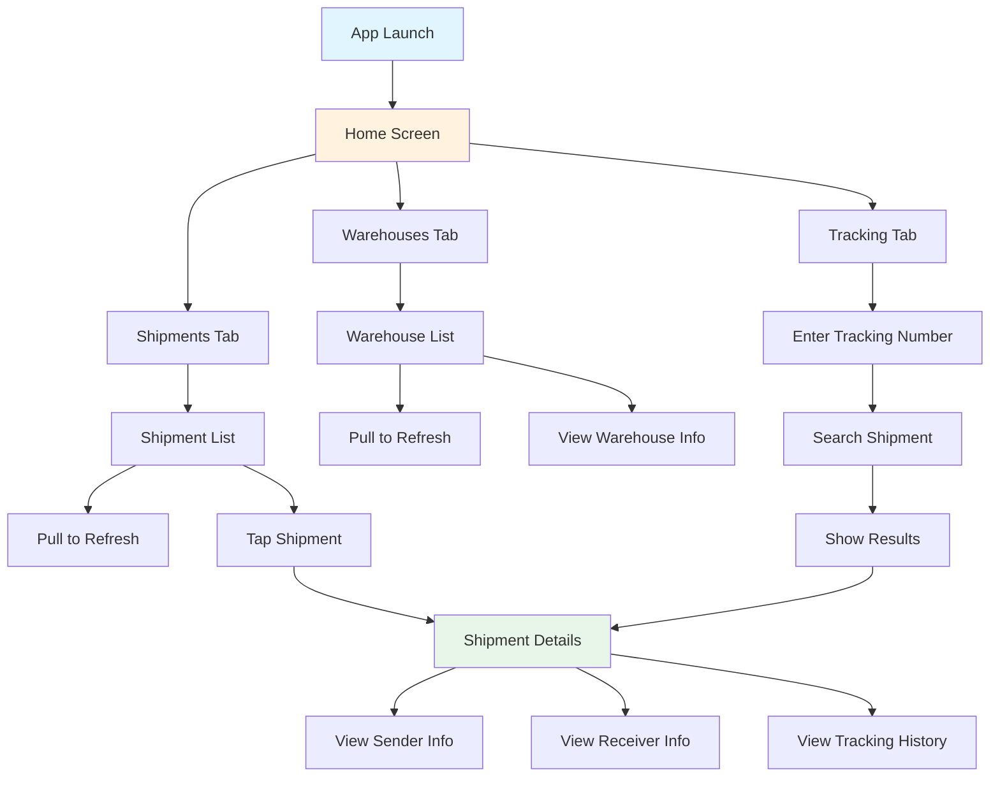
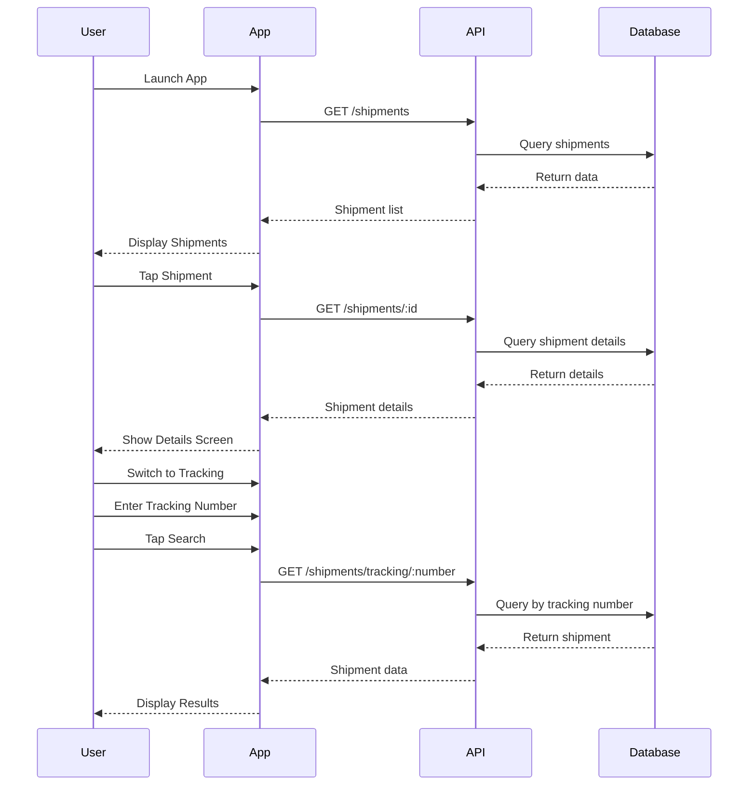
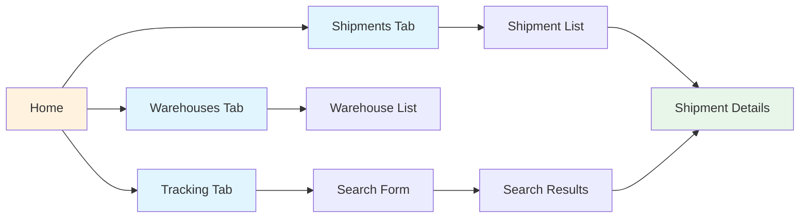

# Wireframes & UI Mockups / โครงสร้างหน้าจอและตัวอย่าง UI

This document contains wireframes and UI mockups for the Transportation System mobile application.

เอกสารนี้ประกอบไปด้วยโครงสร้างหน้าจอและตัวอย่าง UI สำหรับแอปพลิเคชันมือถือระบบติดตามการขนส่ง

## Table of Contents / สารบัญ

1. [User Flow Diagram](#user-flow-diagram)
2. [Screen Overview](#screen-overview)
3. [Wireframes](#wireframes)
   - [Home Screen with Bottom Navigation](#1-home-screen-with-bottom-navigation)
   - [Shipments List Screen](#2-shipments-list-screen)
   - [Warehouses List Screen](#3-warehouses-list-screen)
   - [Tracking Screen](#4-tracking-screen)
   - [Shipment Details Screen](#5-shipment-details-screen)
4. [UI Components](#ui-components)
5. [Color Scheme](#color-scheme)
6. [Design Guidelines](#design-guidelines)

---

## User Flow Diagram



---

## Screen Overview

The app consists of 5 main screens:

| Screen | Purpose | Key Features |
|--------|---------|--------------|
| Home | Navigation hub | Bottom navigation bar |
| Shipments | List all shipments | Status filters, pull-to-refresh |
| Warehouses | List all warehouses | Active/inactive status |
| Tracking | Search by tracking number | Real-time tracking |
| Shipment Details | Detailed shipment info | Timeline, sender/receiver info |

---

## Wireframes

### 1. Home Screen with Bottom Navigation

```
┌─────────────────────────────────────┐
│  Transportation System          ⚙️  │ <- AppBar
├─────────────────────────────────────┤
│                                     │
│         MAIN CONTENT AREA           │
│                                     │
│     (Selected Tab Content          │
│      Displays Here)                │
│                                     │
│                                     │
│                                     │
│                                     │
│                                     │
│                                     │
│                                     │
│                                     │
│                                     │
│                                     │
│                                     │
├─────────────────────────────────────┤
│  📦         🏢          🔍          │ <- Bottom Navigation
│ Shipments  Warehouses  Tracking    │
│  [Active]    [Idle]     [Idle]     │
└─────────────────────────────────────┘
```

**Features:**
- ✅ Material Design 3 AppBar
- ✅ Bottom Navigation with 3 tabs
- ✅ Active tab highlighted in blue
- ✅ Icon + Label for each tab

---

### 2. Shipments List Screen

```
┌─────────────────────────────────────┐
│ ← Transportation System         ⚙️  │
├─────────────────────────────────────┤
│  Pull down to refresh...        ↓   │
├─────────────────────────────────────┤
│                                     │
│ ┌─────────────────────────────────┐ │
│ │ 📦 TRK001              [PENDING]│ │
│ │ Electronics                     │ │
│ │ From: John Doe                  │ │
│ │ To: Jane Smith                  │ │
│ │ Est. Delivery: 2025-10-25       │ │
│ │                         🟠      │ │
│ └─────────────────────────────────┘ │
│                                     │
│ ┌─────────────────────────────────┐ │
│ │ 📦 TRK002          [IN_TRANSIT] │ │
│ │ Furniture                       │ │
│ │ From: Alice Brown               │ │
│ │ To: Bob Wilson                  │ │
│ │ Est. Delivery: 2025-10-22       │ │
│ │                         🔵      │ │
│ └─────────────────────────────────┘ │
│                                     │
│ ┌─────────────────────────────────┐ │
│ │ 📦 TRK003            [DELIVERED]│ │
│ │ Books                           │ │
│ │ From: Carol Davis               │ │
│ │ To: David Miller                │ │
│ │ Delivered: 2025-10-18           │ │
│ │                         🟢      │ │
│ └─────────────────────────────────┘ │
│                                     │
├─────────────────────────────────────┤
│  📦    🏢    🔍                     │
└─────────────────────────────────────┘
```

**Features:**
- ✅ Pull-to-refresh functionality
- ✅ Card-based list items
- ✅ Status color indicators
  - 🟠 Orange: Pending
  - 🔵 Blue: In Transit
  - 🟢 Green: Delivered
  - 🔴 Red: Cancelled
- ✅ Key information visible
- ✅ Tap to view details

**Status Colors:**
```
PENDING    ███ Orange (#FF9800)
IN_TRANSIT ███ Blue   (#2196F3)
DELIVERED  ███ Green  (#4CAF50)
CANCELLED  ███ Red    (#F44336)
```

---

### 3. Warehouses List Screen

```
┌─────────────────────────────────────┐
│ ← Transportation System         ⚙️  │
├─────────────────────────────────────┤
│  Pull down to refresh...        ↓   │
├─────────────────────────────────────┤
│                                     │
│ ┌─────────────────────────────────┐ │
│ │ 🏢 Bangkok Central Warehouse    │ │
│ │                                 │ │
│ │ Type: WAREHOUSE                 │ │
│ │ 📍 789 Industrial Rd, Bangkok   │ │
│ │ 📞 021234567                    │ │
│ │ 👤 Manager: Somchai P.          │ │
│ │                   ✅ ACTIVE     │ │
│ └─────────────────────────────────┘ │
│                                     │
│ ┌─────────────────────────────────┐ │
│ │ 🏪 Chiang Mai Store #1          │ │
│ │                                 │ │
│ │ Type: STORE                     │ │
│ │ 📍 123 Main St, Chiang Mai      │ │
│ │ 📞 053111222                    │ │
│ │ 👤 Manager: Arisara K.          │ │
│ │                   ✅ ACTIVE     │ │
│ └─────────────────────────────────┘ │
│                                     │
│ ┌─────────────────────────────────┐ │
│ │ 🏭 Phuket Distribution Center   │ │
│ │                                 │ │
│ │ Type: DISTRIBUTION_CENTER       │ │
│ │ 📍 456 Port Rd, Phuket          │ │
│ │ 📞 076333444                    │ │
│ │ 👤 Manager: Niran S.            │ │
│ │                  ⭕ INACTIVE    │ │
│ └─────────────────────────────────┘ │
│                                     │
├─────────────────────────────────────┤
│  📦    🏢    🔍                     │
└─────────────────────────────────────┘
```

**Features:**
- ✅ List of warehouses/stores
- ✅ Type indicator (Warehouse/Store/Distribution Center)
- ✅ Location and contact info
- ✅ Manager name
- ✅ Active/Inactive status
- ✅ Icon based on type
  - 🏢 Warehouse
  - 🏪 Store
  - 🏭 Distribution Center

---

### 4. Tracking Screen

```
┌─────────────────────────────────────┐
│ ← Transportation System         ⚙️  │
├─────────────────────────────────────┤
│  Track Your Shipment                │
│  ติดตามพัสดุของคุณ                  │
├─────────────────────────────────────┤
│                                     │
│  Enter Tracking Number              │
│  ใส่เลขติดตามพัสดุ                  │
│                                     │
│  ┌─────────────────────────────┐   │
│  │ TRK______________________   │   │
│  │                          🔍 │   │
│  └─────────────────────────────┘   │
│                                     │
│       ┌─────────────────┐          │
│       │  Track Shipment │          │
│       │   ติดตามพัสดุ    │          │
│       └─────────────────┘          │
│                                     │
│  ─────────────────────────────────  │
│                                     │
│  Recent Searches:                   │
│                                     │
│  • TRK001 - Electronics             │
│  • TRK002 - Furniture               │
│  • TRK003 - Books                   │
│                                     │
│                                     │
├─────────────────────────────────────┤
│  📦    🏢    🔍                     │
└─────────────────────────────────────┘
```

**After Searching:**

```
┌─────────────────────────────────────┐
│ ← Transportation System         ⚙️  │
├─────────────────────────────────────┤
│  Tracking Results                   │
├─────────────────────────────────────┤
│                                     │
│ ┌─────────────────────────────────┐ │
│ │      📦 TRK001                  │ │
│ │                                 │ │
│ │    ✅ FOUND                     │ │
│ │                                 │ │
│ │ Electronics                     │ │
│ │ Status: IN TRANSIT              │ │
│ │                                 │ │
│ │ From: John Doe                  │ │
│ │       Bangkok                   │ │
│ │                                 │ │
│ │ To:   Jane Smith                │ │
│ │       Chiang Mai                │ │
│ │                                 │ │
│ │ Est. Delivery: 2025-10-25       │ │
│ │                                 │ │
│ │    [View Full Details →]        │ │
│ └─────────────────────────────────┘ │
│                                     │
│                                     │
├─────────────────────────────────────┤
│  📦    🏢    🔍                     │
└─────────────────────────────────────┘
```

**Features:**
- ✅ Search input field
- ✅ Search button
- ✅ Recent searches list
- ✅ Search results display
- ✅ Quick navigation to details
- ✅ Bilingual labels (Thai/English)

---

### 5. Shipment Details Screen

```
┌─────────────────────────────────────┐
│ ← Shipment Details             ⚙️  │
├─────────────────────────────────────┤
│                                     │
│ ┌─────────────────────────────────┐ │
│ │          🔵 IN TRANSIT          │ │
│ │                                 │ │
│ │      Tracking: TRK001           │ │
│ └─────────────────────────────────┘ │
│                                     │
│ ─────────────────────────────────   │
│ Shipment Details                    │
│ ─────────────────────────────────   │
│                                     │
│ 📦 Item: Electronics                │
│ ⚖️  Weight: 5.5 kg                  │
│ 🔢 Quantity: 2 units                │
│ 📅 Est. Delivery: 2025-10-25        │
│ 📝 Notes: Handle with care          │
│                                     │
│ ─────────────────────────────────   │
│ Sender & Receiver                   │
│ ─────────────────────────────────   │
│                                     │
│ FROM:                               │
│ 👤 John Doe                         │
│ 📍 123 Main St, Bangkok 10100       │
│ 📞 0812345678                       │
│                                     │
│          ↓ ↓ ↓                     │
│                                     │
│ TO:                                 │
│ 👤 Jane Smith                       │
│ 📍 456 Oak Ave, Chiang Mai 50000    │
│ 📞 0887654321                       │
│                                     │
│ ─────────────────────────────────   │
│ Tracking History                    │
│ ─────────────────────────────────   │
│                                     │
│ ● 📍 Package received at warehouse  │
│   2025-10-19 14:30                  │
│   Bangkok Central Warehouse         │
│   │                                 │
│   ●  📦 Package in transit          │
│      2025-10-19 10:00               │
│      Departed from sender           │
│      │                              │
│      ●  ✅ Order created            │
│         2025-10-19 09:00            │
│         Order placed                │
│                                     │
└─────────────────────────────────────┘
```

**Features:**
- ✅ Large status indicator at top
- ✅ Tracking number display
- ✅ Detailed shipment information
- ✅ Sender and receiver cards
- ✅ Visual flow indicator (FROM → TO)
- ✅ Timeline-style tracking history
- ✅ Timestamps and locations
- ✅ Scroll view for long content

**Tracking History Timeline:**
```
Current Location
    ●───────
    │
Previous Location
    ●───────
    │
First Location
    ●
```

---

## UI Components

### Status Badge Component

```
┌──────────────┐
│   PENDING   │  Orange background
└──────────────┘

┌──────────────┐
│ IN_TRANSIT  │  Blue background
└──────────────┘

┌──────────────┐
│  DELIVERED  │  Green background
└──────────────┘

┌──────────────┐
│  CANCELLED  │  Red background
└──────────────┘
```

### Card Component

```
┌─────────────────────────────────────┐
│ 📦 Title Text                      │
│                                     │
│ Subtitle or description text        │
│ Additional information              │
│                                     │
│ Footer text or actions          →  │
└─────────────────────────────────────┘
```

### Bottom Navigation Component

```
┌──────┬──────┬──────┐
│  📦  │  🏢  │  🔍  │
│ Text │ Text │ Text │
└──────┴──────┴──────┘
```

---

## Color Scheme

### Primary Colors

```yaml
Primary: #2196F3 (Blue)
  - Used for: AppBar, Primary buttons, Active states
  
Secondary: #FF9800 (Orange)
  - Used for: Accents, Pending status
  
Background: #FFFFFF (White)
  - Used for: Screen backgrounds

Surface: #F5F5F5 (Light Grey)
  - Used for: Cards, containers
```

### Status Colors

```yaml
Pending: #FF9800 (Orange)
In Transit: #2196F3 (Blue)
Delivered: #4CAF50 (Green)
Cancelled: #F44336 (Red)

Active: #4CAF50 (Green)
Inactive: #9E9E9E (Grey)
```

### Text Colors

```yaml
Primary Text: #212121 (Dark Grey)
Secondary Text: #757575 (Medium Grey)
Disabled Text: #BDBDBD (Light Grey)
```

---

## Design Guidelines

### Typography

```yaml
App Title: 
  - Size: 20sp
  - Weight: Medium
  - Color: White

Screen Headers:
  - Size: 18sp
  - Weight: Medium
  - Color: Primary Text

Card Titles:
  - Size: 16sp
  - Weight: Medium
  - Color: Primary Text

Body Text:
  - Size: 14sp
  - Weight: Regular
  - Color: Primary Text

Caption/Subtitle:
  - Size: 12sp
  - Weight: Regular
  - Color: Secondary Text
```

### Spacing

```yaml
Screen Padding: 16dp
Card Margin: 8dp
Element Spacing: 8dp
Section Spacing: 16dp
Icon Size: 24dp
```

### Interaction

```yaml
Tap Target: Minimum 48dp
Button Height: 48dp
Input Field Height: 56dp
Card Elevation: 2dp
Ripple Effect: Enabled
```

---

## Screen Flow Diagram



---

## Navigation Structure



---

## Responsive Design

### Mobile Portrait (Most Common)
- Width: 360dp - 420dp
- Single column layout
- Bottom navigation
- Scrollable content

### Mobile Landscape
- Width: 640dp - 900dp
- Adapt to wider screen
- Keep bottom navigation
- Optimize content display

### Tablet
- Width: 600dp+
- Consider master-detail layout
- Side navigation possible
- Multiple columns for lists

---

## Accessibility

### Considerations

✅ **Color Contrast**: All text meets WCAG AA standards
✅ **Touch Targets**: Minimum 48dp for all interactive elements
✅ **Text Scaling**: Supports system font scaling
✅ **Screen Readers**: Semantic labels for all UI elements
✅ **Icons**: Always paired with text labels
✅ **Status Indicators**: Use color + text/icon (not color alone)

---

## Future Enhancements

### Potential Features

- 🔄 Real-time updates with WebSocket
- 📸 Photo proof of delivery
- 🗺️ Map view for tracking
- 📊 Analytics dashboard
- 🔔 Push notifications
- 📱 QR code scanning
- 🌙 Dark mode support
- 🌐 Multi-language support
- 📴 Offline mode

---

## Notes

- All wireframes follow Material Design 3 guidelines
- Colors and spacing are consistent with Flutter's Material theme
- Icons use Material Icons font
- All screens support pull-to-refresh
- Navigation uses bottom navigation bar pattern
- Cards use elevation for depth
- Responsive to different screen sizes

---

**Created for Transportation System**  
**สร้างสำหรับระบบติดตามการขนส่ง**

Last Updated: 2025-10-19
